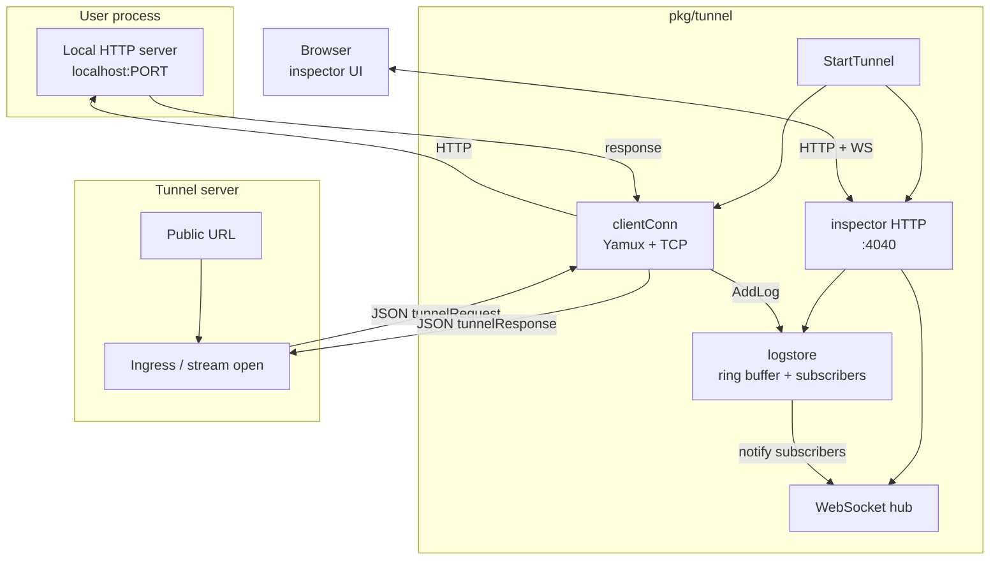
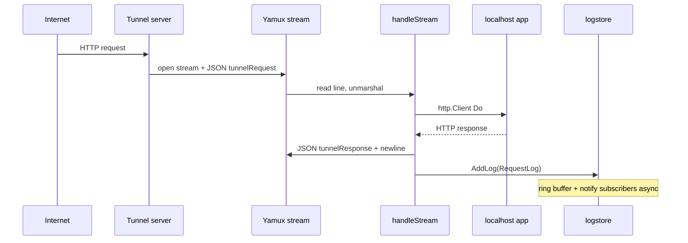
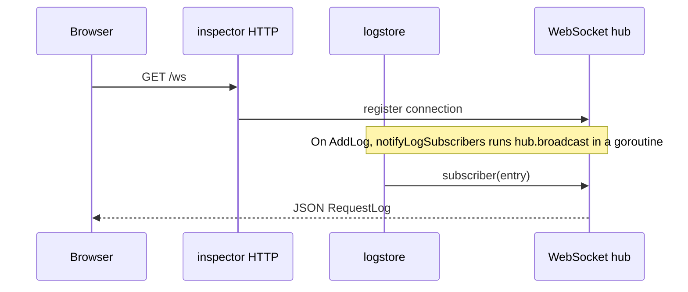
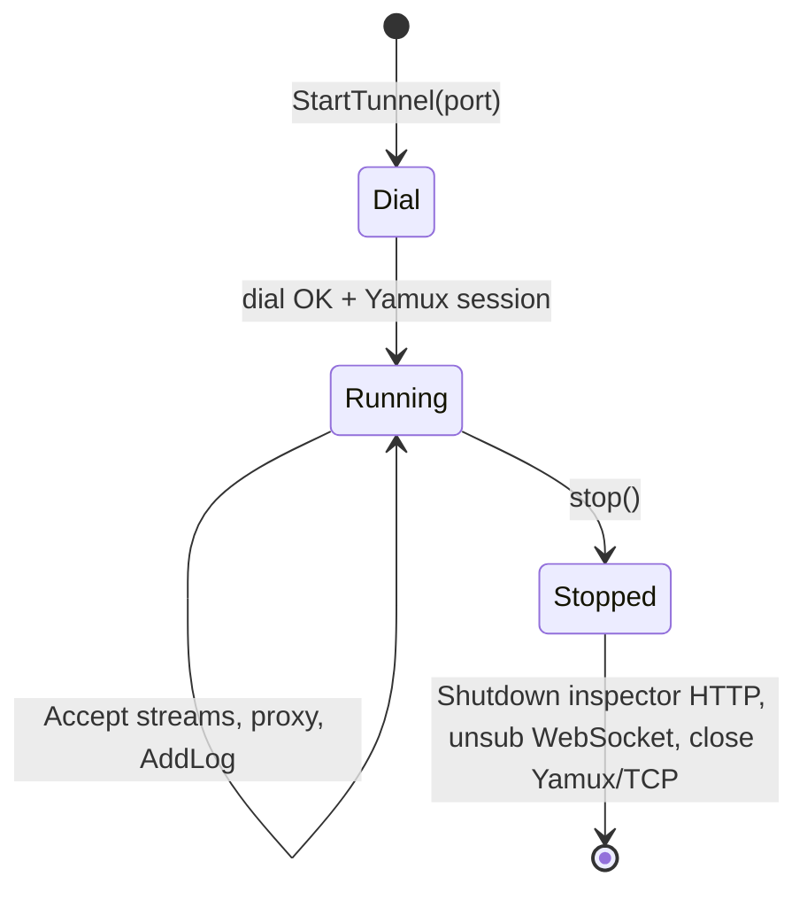

# gotunnel architecture

This document describes how `pkg/tunnel` is organized, how traffic flows through the system, and where to extend behavior safely.

## Package layout (`pkg/tunnel`)

| File | Responsibility |
|------|----------------|
| `tunnel.go` | Public API: [StartTunnel](../pkg/tunnel/tunnel.go) orchestration (dial, inspector, forwarder). |
| `options.go` | [TunnelOptions](../pkg/tunnel/models.go), defaults, option merging. |
| `client.go` | Control-plane TCP dial, Yamux session, per-stream HTTP proxy to localhost. |
| `wire.go` | JSON wire types for one stream request/response line. |
| `models.go` | Domain types: [RequestLog](../pkg/tunnel/models.go), [clientHello](../pkg/tunnel/models.go), themes. |
| `logstore.go` | In-memory ring buffer of [RequestLog](../pkg/tunnel/models.go), [AddLog](../pkg/tunnel/logstore.go) / [GetLogs](../pkg/tunnel/logstore.go), **pluggable subscribers** for live updates. |
| `inspector.go` | Loopback HTTP server: UI (embedded HTML), `GET /logs`, `GET /ws`, `POST /replay`. |
| `replay.go` | Replay handler: POST JSON → local app. |
| `utils.go` | IDs (connection, request). |
| `inspector_page.html` | Embedded inspector UI (via `go:embed`). |

**Dependency direction (high level):** `tunnel.go` → `client` + `inspector` + `logstore`; `client` → `logstore` (after each proxied request); `inspector` registers a log subscriber on `logstore`.

## Component diagram

## Sequence: public request → local app

## Sequence: inspector live updates

## Extension points (scalability)

1. **More live consumers of traffic** — Call [RegisterLogSubscriber](../pkg/tunnel/logstore.go) from application or library code to receive each [RequestLog](../pkg/tunnel/models.go) without modifying the inspector.
2. **Replace in-memory logs** — Introduce a `LogStore` interface and inject an implementation; keep [GetLogs](../pkg/tunnel/logstore.go) / [AddLog](../pkg/tunnel/logstore.go) as adapters during migration.
3. **Control plane** — [dialClient](../pkg/tunnel/client.go) and [defaultControlAddr](../pkg/tunnel/client.go) are natural places for TLS, auth, or configurable server addresses.
4. **Protocol** — [wire.go](../pkg/tunnel/wire.go) centralizes JSON shapes for the Yamux line protocol.

## Lifecycle: StartTunnel / stop

